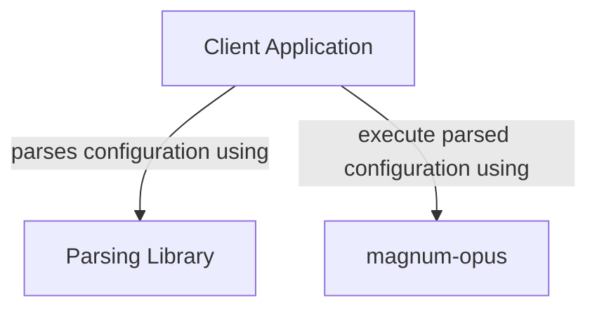

```text
o   o   O   o-o  o   o o   o o   o 
|\ /|  / \ o     |\  | |   | |\ /| 
| O | o---o|  -o | \ | |   | | O | 
|   | |   |o   | |  \| |   | |   | 
o   o o   o o-o  o   o  o-o  o   o 
                                   
                                   
     o-o  o--o  o   o  o-o         
    o   o |   | |   | |            
    |   | O--o  |   |  o-o         
    o   o |     |   |     |        
     o-o  o      o-o  o--o         
```

- [About](#about)
- [Usage](#usage)
  - [Features](#features)
  - [Hello World Example](#hello-world-example)
- [Development Quick Start](#development-quick-start)

# About

A python based task processing workflow backend.

# Usage

The intent of this project is to use it as a library to process tasks that conform to a certain style.

A typical stack will include the following components:



Detailed documentation is provided in the source code.

## Features

* Resources are defined as a `Task`
* A `TaskProcessor` is a class that needs to be extended. This class holds the processing logic to create, delete and updated resources
* A placeholder class for task state persistence is provided
* Tasks can have dependencies on other tasks. The workflow engine will calculate the order of processing required based on the dependency definition
* Support for "environments" through the concept of a "context". In terms of infrastructure resources, you could define contexts as "development", "test" and "production". In cloud environments, each context could also be linked to a different cloud account (or equivalent).
* Dynamic variable substitution. Before each task is processed, any variables in the task spec will first be resolved to determine the final values. When a task is processed, it may produce variables that can be used in the spec of other tasks.
* Workflow orchestration is done by calling one or more `Hook` instances on each tasks. Each hook can perform a specific function. In most use cases there will always need to be at least one hook for processing tasks, and one is generic implementation is provided through the `TaskProcessingHook`
* Logging through standard Python logging framework
* Command mapping can be customized. The default commands include:
  * `create` - Creates new resources
  * `delete` - Deletes existing resources
  * `update` - Updates existing resources
  * `describe` - Describes resources
  * `drift` - Determines if existing deployed resources has drifted (deployed resource no longer resembles the task spec)
  * `rollback` - Used in the workflow to roll back changes in the event of an error - usually called automatically on a task that fails.

## Hello World Example

Here is a really quick ["hello world" example](./examples/hello_world.py) that will implement a `TaskProcessor` that creates a file with the text "Hello World!" in it:

```sh
python3 examples/hello_world.py 2>/dev/null
```

The example can also be observed as a unit test by running the test file [tests/test_hello_world.py](tests/test_hello_world.py)

# Development Quick Start

Preparing your local system for development:

```shell
python3 -m venv venv

. venv/bin/activate

pip3 install coverage build twine
```

