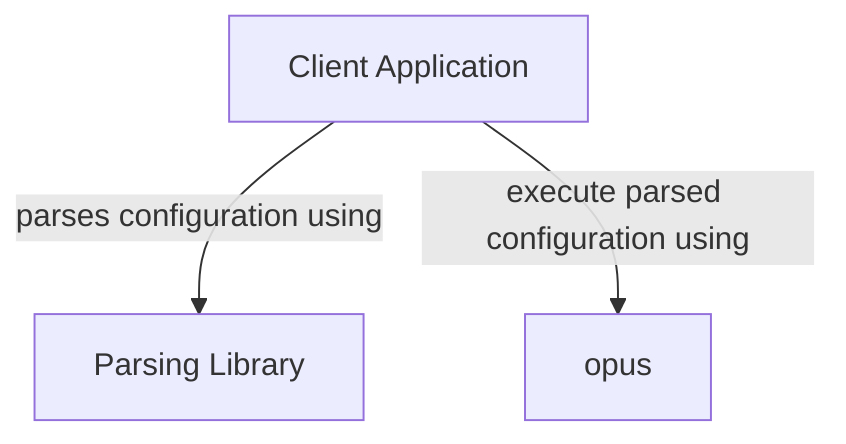

```text
 o-o  o--o  o   o  o-o  
o   o |   | |   | |     
|   | O--o  |   |  o-o  
o   o |     |   |     | 
 o-o  o      o-o  o--o  
```

- [About](#about)
- [Usage](#usage)
  - [Hello World Example](#hello-world-example)
- [Development Quick Start](#development-quick-start)

# About

A python based task processing engine backend.

# Usage

The intent of this project is to use it as a library to process tasks that conform to a certain style.

A typical stack will include the following components:



The client application has to provide the following implementations:

| Base Class         | Usage                                                                                                                                                                                                                                                                                      |
|--------------------|--------------------------------------------------------------------------------------------------------------------------------------------------------------------------------------------------------------------------------------------------------------------------------------------|
| `LoggerWrapper`    | ( optional ) Used for logging. If not implemented, log messages from `opus` will be printed to STDOUT                                                                                                                                                                                      |
| `StatePersistance` | ( optional ) Used to persist state during the various stages of task execution. Can also be used by `TaskProcessor` implementation to retrieve previous execution state of any individual task. If not implemented by the client, no persistance functionality will be provided/available. |
| `TaskProcessor`    | ( required ) This is the class that implements the logic of processing a given task. No out-of-the-bos task processors exist, so the client must supply it's own.                                                                                                                          |

The client then creates an instance of `Tasks` and adds all `TaskProcessor` implementations before adding `Task` objects. Finally, the processing is performed by calling the `process_context()` method of the `Tasks` instance.

## Hello World Example

Here is a really quick ["hello world" example](./examples/hello_world.py) that will implement a `TaskProcessor` that creates a file with the text "Hello World!" in it:

```sh
python3 examples/hello_world.py
```

# Development Quick Start

Preparing your local system for development:

```shell
python3 -m venv venv

. venv/bin/activate

pip3 install coverage build twine
```

